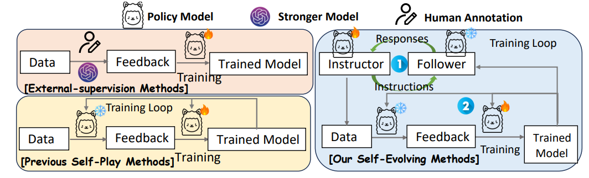
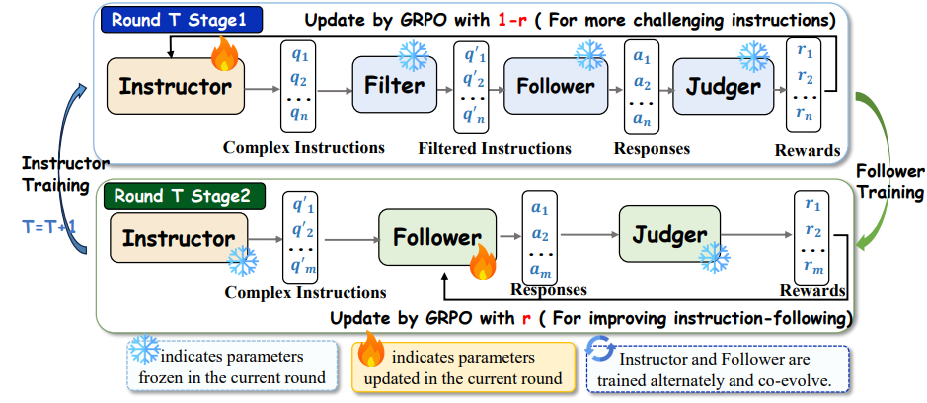

# 🚀 SEIF: Self-Evolving Reinforcement Learning for Instruction Following

This repository implements **SEIF**, an iterative self-training framework for instruction-following models. SEIF consists of two mutually improving roles:

* 🧑‍🏫 **Instructor**: learns to generate diverse and challenging multi-constraint instructions.
* 🧑‍🎓 **Follower**: learns to follow the multi-constraint instructions generated by the Instructor.

The training process alternates between improving the Instructor and the Follower, enabling both models to progressively evolve over multiple rounds.

<p align="center">
  
</p>

<p align="center">
  <b>Figure 1.</b> Comparison of training paradigms for instruction-following. Existing methods either rely on external supervision or improve through self-play with instructions of static difficulty, which cannot evolve as the model's capabilities improve. In contrast, SEIF establishes a closed self-evolution loop during training, in which the Instructor generates more challenging instructions, and the Follower learns to follow the new instructions, enabling co-evolution.
</p>

---

## 📚 Table of Contents

1. [📌 Project Overview](#project-overview)
2. [📁 Directory Structure](#directory-structure)
3. [🧩 Key Files](#key-files)
4. [🔁 Iterative Training Workflow](#iterative-training-workflow)
5. [🛠️ Detailed Steps](#detailed-steps)

   * [⚙️ 5.1 First-Time Setup](#51-first-time-setup)
   * [🧑‍🏫 5.2 Round 1: Train the Instructor](#52-round-1-train-the-instructor)
   * [🧑‍🎓 5.3 Round 1: Train the Follower](#53-round-1-train-the-follower)
   * [🧑‍🏫 5.4 Round T, T ≥ 2: Train the Next Instructor](#54-round-t-t--2-train-the-next-instructor)
   * [🧑‍🎓 5.5 Round T, T ≥ 2: Train the Next Follower](#55-round-t-t--2-train-the-next-follower)
6. [⚙️ Configuration](#configuration)
7. [🏆 Reward Functions](#reward-functions)
8. [📊 Iteration Summary](#iteration-summary)

---

<a id="project-overview"></a>

## 📌 1. Project Overview

SEIF builds on the Self-IF framework and introduces an iterative reinforcement learning pipeline for instruction following. In each training round:

1. The **Instructor** generates multi-constraint instructions based on seed questions.
2. The **Follower** is trained to follow the generated instructions.
3. The newly trained Follower is then used as the evaluator for the next round of Instructor training.

The core idea is to use the latest Follower as a judge, filter, and answer model during Instructor training. This encourages the Instructor to generate instructions that the current Follower cannot yet follow well. As a result, the Instructor learns to produce progressively harder and more diverse constraints, while the Follower continuously improves its ability to satisfy complex multi-constraint instructions.

---

<a id="directory-structure"></a>

## 📁 2. Directory Structure

```text
EasyR1-main/
├── vllm_answer.sh              # vLLM server for answer generation, port 55222
├── vllm_filter.sh              # vLLM server for constraint-conflict filtering, port 55333
├── vllm_judge.sh               # vLLM server for constraint judgment, port 55111
├── vllm_verifer.sh             # vLLM server for all-in-one verification, port 55111
├── examples/
│   ├── config.yaml             # Instructor training configuration
│   ├── config1.yaml            # Follower training configuration
│   ├── qwen.sh                 # Instructor training launcher
│   ├── qwen1.sh                # Follower training launcher
│   ├── runtime_env.yaml        # Runtime environment variables
│   ├── reward_function/
│   │   ├── instruction_reward.py  # Reward functions for Instructor/Follower training
│   │   └── r1v.py              # Visual reasoning reward; not used in the main pipeline
│   └── format_prompt/
│       ├── r1v_format.jinja    # R1V prompt template
│       └── math_format.jinja   # Math prompt template
├── verl/                       # RL training framework based on verl
│   ├── trainer/
│   │   ├── main.py             # Training entry point
│   │   ├── ray_trainer.py
│   │   └── ...
│   ├── utils/
│   │   └── dataset.py          # Dataset utilities; switch active class by role
│   └── ...
├── data/
│   ├── seed.parquet            # Seed questions for initial training
│   ├── Self-IF-Self-QWEN-7B/   # Data and scripts for the Qwen-7B model family
│   │   ├── chuti.py            # Constraint generation script
│   │   ├── vllm_chuti.sh       # vLLM server for constraint generation
│   │   ├── q_T1.parquet        # Follower training data for Turn 1
│   │   ├── q_T2.parquet        # Follower training data for Turn 2
│   │   └── ...
│   ├── Self-IF-Self-QWEN-1.5B/
│   ├── Self-IF-Self-LLAMA-8B/
│   ├── Self-IF-Self-DISTILL-14B/
│   └── Self-IF-Self-R1-QWEN3/
└── ...
```

---

<a id="key-files"></a>

## 🧩 3. Key Files

### 🏆 3.1 Reward Function: `examples/reward_function/instruction_reward.py`

This file contains the reward functions for both Instructor and Follower training. Both implementations are included in the same file, but only one should be active at a time. To switch between roles, comment or uncomment the corresponding blocks.

#### 🧑‍🏫 Instructor Training Reward

The Instructor reward block is active by default at the top of the file. It uses three vLLM endpoints for verification:

| Model         |  Port | Role                                                       |
| ------------- | ----: | ---------------------------------------------------------- |
| `ANSWER_VLLM` | 55222 | 💬 Generates answers for verifying constraint feasibility  |
| `FILTER_VLLM` | 55333 | 🔍 Detects logically conflicting constraints               |
| `JUDGE_VLLM`  | 55111 | ✅ Judges whether each constraint is followed              |

Main functions:

* `instruction_compute_score()`
* `instruction_val_compute_score()`

#### 🧑‍🎓 Follower Training Reward

The Follower reward block is commented out by default, approximately from line 1 to line 1040. It uses `instructions_registry` and the corresponding per-constraint `check_following()` methods.

The main function is the commented `instruction_compute_score()` near line 82. This implementation directly evaluates the Follower's response against each constraint stored in the generated `q_Tk.parquet` data.

---

### 📦 3.2 Dataset Utility: `verl/utils/dataset.py`

This file contains dataset classes for both Instructor and Follower training. As with the reward function file, both implementations are included, but only one should be active at a time.

#### 🧑‍🏫 Instructor Dataset

The active Instructor `RLHFDataset` class is located around line 220. It uses either `TASK_DESCRIPTION_TEMPLATE_HARD` or `TASK_DESCRIPTION_TEMPLATE_SOFT` to construct multi-constraint prompts from seed questions.

* Training data: `data/seed.parquet`

#### 🧑‍🎓 Follower Dataset

The Follower `RLHFDataset` class is commented out by default, approximately from line 375 to line 483. It reads directly from generated parquet files such as `q_T1.parquet`.

The parquet file contains the following columns:

* `instruction_id_list`
* `kwargs`
* `constraints`

These fields are stored in `ground_truth` and used by the reward function to evaluate whether the Follower satisfies the specified constraints.

---

### ⚙️ 3.3 Configuration Files

| File                    | Purpose             | Key Settings                                                                |
| ----------------------- | ------------------- | --------------------------------------------------------------------------- |
| `examples/config.yaml`  | Instructor training | `train_files: data/seed.parquet`, GRPO algorithm, `n=5` rollouts per prompt |
| `examples/config1.yaml` | Follower training   | Uses `q_Tk.parquet`; otherwise follows the same GRPO settings               |

---

### 📝 3.4 Constraint Generation: `data/Self-IF-Self-QWEN-7B/chuti.py`

This script uses the trained Instructor model to generate multi-constraint instructions for seed questions.

* Input: seed questions
* Output: `q_T{turn}.parquet`

The generated parquet files are then used as training data for the Follower.

---

<a id="iterative-training-workflow"></a>

## 🔁 4. Iterative Training Workflow

The following figure shows the overall SEIF pipeline. SEIF alternates between Instructor optimization and Follower optimization. In each round, the Instructor generates multi-constraint instructions, while the Follower learns to follow these instructions. The updated Follower is then reused as the evaluator for the next Instructor round, forming a self-evolving training loop.

<p align="center">
  
</p>

<p align="center">
  <b>Figure 2.</b> Overview of SEIF. The Instructor learns to generate increasingly challenging multi-constraint instructions, while the Follower learns to satisfy them. The latest Follower serves as the evaluator for training the next Instructor.
</p>

The following diagram illustrates the complete iterative loop using Qwen2.5-7B-Instruct as an example.

```text
Round T, T ≥ 1:
┌─────────────────────────────────────────────────────────┐
│ STEP 1: Train Instructor I_T                            │
│ ─────────────────────────────────────────────────────── │
│ Use vLLM servers: ANSWER, FILTER, and JUDGE.            │
│ For T=1, use the base model as the evaluator.           │
│ For T≥2, use the previous Follower F_{T-1}.             │
│                                                         │
│ Training data: data/seed.parquet                        │
│ Config: examples/config.yaml                            │
│ dataset.py: enable the Instructor RLHFDataset           │
│ reward: enable the Instructor reward functions          │
│ Output: Instructor checkpoint I_T                       │
└─────────────────────────────────────────────────────────┘
                          │
                          ▼
┌─────────────────────────────────────────────────────────┐
│ STEP 2: Serve Instructor I_T for Data Generation        │
│ ─────────────────────────────────────────────────────── │
│ Start vllm_chuti.sh with Instructor I_T.                │
│ Run chuti.py to generate q_T.parquet.                   │
│                                                         │
│ Example output:                                         │
│ data/Self-IF-Self-QWEN-7B/q_T1.parquet                  │
└─────────────────────────────────────────────────────────┘
                          │
                          ▼
┌─────────────────────────────────────────────────────────┐
│ STEP 3: Train Follower F_T                              │
│ ─────────────────────────────────────────────────────── │
│ Use the vLLM verifier server.                           │
│ For T=1, initialize from the base model.                │
│ For T≥2, initialize from the previous Follower F_{T-1}. │
│                                                         │
│ Training data: q_T.parquet                              │
│ Config: examples/config1.yaml                           │
│ dataset.py: enable the Follower RLHFDataset             │
│ reward: enable the Follower reward functions            │
│ Output: Follower checkpoint F_T                         │
└─────────────────────────────────────────────────────────┘

Round T+1:
  → Use F_T as the evaluator for the next Instructor.
  → Train Instructor I_{T+1}.
  → Serve I_{T+1} and generate q_{T+1}.parquet.
  → Train Follower F_{T+1} using q_{T+1}.parquet.
  → Repeat.
```

---

<a id="detailed-steps"></a>

## 🛠️ 5. Detailed Steps

<a id="51-first-time-setup"></a>

### ⚙️ 5.1 First-Time Setup

Before starting iterative training, complete the following setup steps:

1. **Prepare seed data**

   Ensure that `data/seed.parquet` contains the seed questions.

2. **Prepare base models**

   Download the base model, for example `Qwen/Qwen2.5-7B-Instruct`.

3. **Install dependencies**

   Make sure `verl`, `vllm`, `ray`, and other required dependencies are installed.

4. **Set up GPU resources**

   Allocate the required GPUs for both vLLM serving and training. See the corresponding vLLM server scripts for details.

---

<a id="52-round-1-train-the-instructor"></a>

### 🧑‍🏫 5.2 Round 1: Train the Instructor

#### 🚦 Step 1.1: Start vLLM Servers for Evaluation

Use the base model, or another pretrained model, as the initial evaluator.

```bash
# Terminal 1: Answer model, port 55222
bash vllm_answer.sh

# Terminal 2: Filter model, port 55333
bash vllm_filter.sh

# Terminal 3: Judge model, port 55111
bash vllm_judge.sh
```

Before starting training, make sure that all three vLLM servers are running and responsive.

#### 🏆 Step 1.2: Enable the Instructor Reward

In `examples/reward_function/instruction_reward.py`:

* Uncomment the Instructor reward block at the top of the file.
* Comment out the Follower reward block, approximately from line 1 to line 1040.

#### 📦 Step 1.3: Enable the Instructor Dataset

In `verl/utils/dataset.py`:

* Uncomment the Instructor `RLHFDataset` class, around line 220.
* Comment out the Follower `RLHFDataset` class, approximately from line 375 to line 483.

#### ⚙️ Step 1.4: Configure the Instructor Training Launcher

Edit `examples/qwen.sh` and set the model and save paths:

```bash
MODEL_PATH=Qwen/Qwen2.5-7B-Instruct  # Or the path to your base model
SAVE_PATH=/path/to/save/I_T1
```

#### 🚀 Step 1.5: Launch Instructor Training

```bash
bash examples/qwen.sh
```

This trains the Instructor with GRPO on `data/seed.parquet`. The Instructor learns to generate diverse and challenging multi-constraint instructions.

**Output:** Instructor checkpoint, for example `/path/to/I_T1/`.

---

<a id="53-round-1-train-the-follower"></a>

### 🧑‍🎓 5.3 Round 1: Train the Follower

#### 🚦 Step 1.6: Serve the Trained Instructor

After Instructor training finishes, start the trained Instructor as a vLLM service for data generation.

```bash
# Run in a new terminal
bash data/Self-IF-Self-QWEN-7B/vllm_chuti.sh
```

This serves the Instructor at the endpoint configured in `vllm_chuti.sh`. The `chuti.py` script will call this endpoint to generate constraints.

#### 📝 Step 1.7: Generate Follower Training Data

```bash
cd data/Self-IF-Self-QWEN-7B
python chuti.py
```

This generates multi-constraint instructions for the seed questions and saves them as `q_T1.parquet`.

#### 🏆 Step 1.8: Enable the Follower Reward

In `examples/reward_function/instruction_reward.py`:

* Uncomment the Follower reward block, approximately from line 1 to line 1040.
* Comment out the Instructor reward block at the top of the file.

#### 📦 Step 1.9: Enable the Follower Dataset

In `verl/utils/dataset.py`:

* Uncomment the Follower `RLHFDataset` class, approximately from line 375 to line 483.
* Comment out the Instructor `RLHFDataset` class, around line 220.

#### ⚙️ Step 1.10: Configure the Follower Training Launcher

Edit `examples/qwen1.sh`:

```bash
MODEL_PATH=Qwen/Qwen2.5-7B-Instruct  # Base model for the first Follower
SAVE_PATH=/path/to/save/F_T1
DATA_PATH=data/Self-IF-Self-QWEN-7B/q_T1.parquet
```

Also update `examples/config1.yaml`:

```yaml
data:
  train_files: data/Self-IF-Self-QWEN-7B/q_T1.parquet
```

#### ✅ Step 1.11: Start the vLLM Verifier Server

Use the base model as the initial verifier.

```bash
bash vllm_verifer.sh
```

#### 🚀 Step 1.12: Launch Follower Training

```bash
bash examples/qwen1.sh
```

The Follower is trained to follow multi-constraint instructions by maximizing the reward computed by `instruction_compute_score()`.

**Output:** Follower checkpoint, for example `/path/to/F_T1/`.

---

<a id="54-round-t-t--2-train-the-next-instructor"></a>

### 🧑‍🏫 5.4 Round T, T ≥ 2: Train the Next Instructor

Starting from Round 2, the latest Follower `F_{T-1}` is used as the evaluator for Instructor training. This encourages the Instructor to generate instructions that the current Follower still struggles to follow.

#### 🔄 Step 2.1: Update vLLM Servers to Use `F_{T-1}`

Update the model path in all three vLLM server scripts.

In `vllm_answer.sh`:

```bash
MODEL_PATH=/path/to/F_{T-1}
```

In `vllm_filter.sh`:

```bash
MODEL_PATH=/path/to/F_{T-1}
```

In `vllm_judge.sh`:

```bash
MODEL_PATH=/path/to/F_{T-1}
```

Then restart all three servers:

```bash
bash vllm_answer.sh
bash vllm_filter.sh
bash vllm_judge.sh
```

The Instructor's reward depends on how well the current Follower can satisfy the generated constraints. By replacing the evaluator with the latest Follower, SEIF drives the Instructor toward increasingly challenging instruction generation.

#### 🏆 Step 2.2: Enable the Instructor Reward

In `examples/reward_function/instruction_reward.py`:

* Uncomment the Instructor reward block.
* Comment out the Follower reward block.

#### 📦 Step 2.3: Enable the Instructor Dataset

In `verl/utils/dataset.py`:

* Uncomment the Instructor `RLHFDataset` class.
* Comment out the Follower `RLHFDataset` class.

#### 🚀 Step 2.4: Configure and Launch Instructor Training

Edit `examples/qwen.sh`:

```bash
MODEL_PATH=/path/to/I_{T-1}  # Previous Instructor checkpoint
SAVE_PATH=/path/to/save/I_T
```

Then run:

```bash
bash examples/qwen.sh
```

**Output:** New Instructor checkpoint `I_T`.

---

<a id="55-round-t-t--2-train-the-next-follower"></a>

### 🧑‍🎓 5.5 Round T, T ≥ 2: Train the Next Follower

#### 🚦 Step 2.5: Serve the New Instructor `I_T`

Update `vllm_chuti.sh` if necessary, then start the new Instructor service.

```bash
bash data/Self-IF-Self-QWEN-7B/vllm_chuti.sh
```

#### 📝 Step 2.6: Generate New Follower Training Data

```bash
cd data/Self-IF-Self-QWEN-7B
python chuti.py
```

This generates `q_T.parquet`, for example `q_T2.parquet`, containing instructions produced by the latest Instructor.

#### 🏆 Step 2.7: Enable the Follower Reward

In `examples/reward_function/instruction_reward.py`:

* Uncomment the Follower reward block.
* Comment out the Instructor reward block.

#### 📦 Step 2.8: Enable the Follower Dataset

In `verl/utils/dataset.py`:

* Uncomment the Follower `RLHFDataset` class.
* Comment out the Instructor `RLHFDataset` class.

#### ⚙️ Step 2.9: Update `config1.yaml` and `qwen1.sh`

Update `examples/config1.yaml`:

```yaml
data:
  train_files: data/Self-IF-Self-QWEN-7B/q_T.parquet
```

Update `examples/qwen1.sh`:

```bash
MODEL_PATH=/path/to/F_{T-1}  # Previous Follower checkpoint
SAVE_PATH=/path/to/save/F_T
```

#### ✅ Step 2.10: Start the Verifier for Follower Training

For training `F_T`, start the verifier server according to your current experimental setting. In the standard iterative setup, the verifier is usually initialized from the previous Follower `F_{T-1}`.

```bash
MODEL_PATH=/path/to/F_{T-1}
bash vllm_verifer.sh
```

After `F_T` is trained, use `F_T` as the evaluator in the next Instructor round.

#### 🚀 Step 2.11: Launch Follower Training

```bash
bash examples/qwen1.sh
```

**Output:** New Follower checkpoint `F_T`.

---

<a id="configuration"></a>

## ⚙️ 6. Configuration

### 🧑‍🏫 6.1 Instructor Training: `examples/config.yaml`

```yaml
data:
  train_files: data/seed.parquet
  model: Qwen/Qwen2.5-7B-Instruct

algorithm:
  adv_estimator: grpo
  kl_coef: 1.0e-2
  online_filtering: false

worker:
  actor:
    micro_batch_size_for_update: 4
    micro_batch_size_for_experience: 8
    max_grad_norm: 1.0
  rollout:
    temperature: 1.0
    n: 5
    tensor_parallel_size: 2
  reward:
    reward_function: ./examples/reward_function/instruction_reward.py:instruction_compute_score

trainer:
  total_epochs: 1
  logger: ["wandb"]
  project_name: Instructor-Turn-k-QWEN7B
```

### 🧑‍🎓 6.2 Follower Training: `examples/config1.yaml`

```yaml
data:
  train_files: data/Self-IF-Self-QWEN-7B/q_Tk.parquet  # Update this file for each turn
  model: Qwen/Qwen2.5-7B-Instruct

algorithm:
  adv_estimator: grpo
  kl_coef: 1.0e-2
  online_filtering: false

worker:
  actor:
    micro_batch_size_for_update: 4
    micro_batch_size_for_experience: 8
    max_grad_norm: 1.0
  rollout:
    temperature: 1.0
    n: 5
    tensor_parallel_size: 2
  reward:
    reward_function: ./examples/reward_function/instruction_reward.py:instruction_compute_score

trainer:
  total_epochs: 1  # Use 3 for Turn 1 and 1 for subsequent turns
  logger: ["wandb"]
  project_name: Follower-Turn-k-QWEN7B
```

---

<a id="reward-functions"></a>

## 🏆 7. Reward Functions

Both Instructor and Follower training use `instruction_reward.py`. The active reward implementation depends on which block is uncommented.

### 🧑‍🏫 7.1 Instructor Training Reward

The Instructor reward block is located at the top of `instruction_reward.py`.

It uses a three-stage verification pipeline through vLLM endpoints:

1. Parse the generated instruction and extract constraints.
2. Use `FILTER_VLLM` to remove logically conflicting constraints.
3. Use `ANSWER_VLLM` to generate answers for the valid constraints.
4. Use `JUDGE_VLLM` to determine whether each constraint is followed.
5. Return the reward score:

```text
score = number of followed constraints / number of valid constraints
```

A higher score indicates that the Instructor generates clearer and more feasible instructions whose constraints can be verified by the current Follower-based evaluator.

### 🧑‍🎓 7.2 Follower Training Reward

The Follower reward block is commented out by default, approximately from line 1 to line 1040 in `instruction_reward.py`.

It uses `instructions_registry` to directly evaluate each constraint:

1. Parse `instruction_id_list`, `kwargs`, and `constraints` from the parquet file.
2. Instantiate each constraint using `instructions_registry.INSTRUCTION_DICT[ids]`.
3. Call `build_description()` with the stored `kwargs`.
4. Check whether the Follower's response satisfies each constraint via `check_following()`.
5. Return the reward score:

```text
score = number of followed constraints / number of total constraints
```

A higher score indicates that the Follower successfully satisfies more constraints in the generated instruction.

---

<a id="iteration-summary"></a>

## 📊 8. Iteration Summary

| Turn | Instructor                                           | Follower                               | Training Data  |
| ---: | ---------------------------------------------------- | -------------------------------------- | -------------- |
|  T=1 | `I_1`, initialized from the base model               | `F_1`, initialized from the base model | `q_T1.parquet` |
|  T=2 | `I_2`, initialized from `I_1` and evaluated by `F_1` | `F_2`, initialized from `F_1`          | `q_T2.parquet` |
|  T=3 | `I_3`, initialized from `I_2` and evaluated by `F_2` | `F_3`, initialized from `F_2`          | `q_T3.parquet` |
|  ... | ...                                                  | ...                                    | ...            |

Across iterations, the Instructor learns to generate harder and more diverse constraints that the current Follower cannot yet reliably satisfy. Meanwhile, the Follower improves its ability to follow increasingly complex multi-constraint instructions, forming a self-evolving instruction-following loop.
